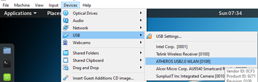
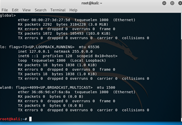
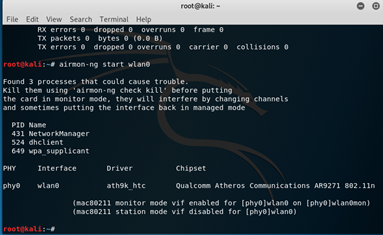
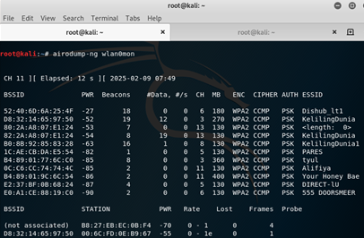
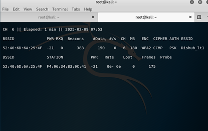

# Wi-Fi Deauthentication (Jamming) Project using Kali Linux

This repository documents a proof-of-concept Wi-Fi Deauthentication (Jamming) project conducted inside a controlled virtual lab environment. The project demonstrates how wireless network vulnerabilities can be exploited using deauthentication frames to disconnect a target station from an Access Point (AP).

> ⚠️ **DISCLAIMER & LEGAL WARNING**
> This project is created strictly for educational purposes, authorized penetration testing, and academic research. Unauthorized disrupting, jamming, or interfering with public or private wireless networks without explicit prior permission is illegal under local and international laws (including cybercrime regulations). The author assumes no liability for any misuse of this material.

---

**Tutorial: https://www.youtube.com/watch?v=wl0bLGVprjg** 

## 🛠️ Hardware & Software Requirements

### Hardware

- **Host Machine:** Laptop/PC.
- **Wireless Adapter:** TP-Link TL-WN722N (Atheros AR9271 Chipset) — *chosen for its native support for Monitor Mode and Packet Injection.*

### Software

- **Hypervisor:** Oracle VM VirtualBox.
- **OS:** Kali Linux (Rolling distribution).
- **Suite:** Aircrack-ng (`airmon-ng`, `airodump-ng`, `aireplay-ng`).

---

## 🚀 Step-by-Step Implementation Guide

### Step 1: Prepare the Virtual Environment

1. Turn off or disconnect the internal internet connection on your Kali Linux instance to avoid interface conflicts.
2. Plug your external Atheros USB wireless adapter into your host machine.
3. Attach the USB device directly to the Kali Linux virtual machine via the VirtualBox menu: Go to **Devices** > **USB** > Select **ATHEROS USB2.0 WLAN**.



---

### Step 2: Verify the Wireless Interface

Open a terminal in Kali Linux and execute the following command to verify that the operating system recognizes the Atheros card:

```bash
sudo ifconfig
```



Locate your wireless interface name (typically identified as `wlan0`).

---

### Step 3: Enable Monitor Mode

To capture and inject raw wireless management frames, initialize monitor mode on the interface by running:

```bash
sudo airmon-ng start wlan0
```



**Note:** If the terminal prompts you regarding conflicting processes (e.g., `NetworkManager`, `wpa_supplicant`), you can clear them using `sudo airmon-ng check kill` if necessary.

Verify that the wireless interface has successfully changed its state by executing `ifconfig` again. The interface name should now appear as `wlan0mon`.

---

### Step 4: Reconnaissance & Network Scanning

Scan the surrounding airspace to identify available Access Points within your adapter's range:

```bash
sudo airodump-ng wlan0mon
```


Analyze the live feed and note down your specific target parameters:

- **BSSID:** The MAC address of the target wireless network Access Point.
- **CH:** The operating frequency channel of the network.
- **ESSID:** The name of the network (e.g., `Dishub_lt1`).

Once you identify the target network, press **Ctrl + C** to stop the broad scan.

---

### Step 5: Target Tracking & Station Identification

Isolate the target Access Point to observe specifically which client devices (STATIONS) are actively associated with it. Open a new terminal tab and run:

```bash
sudo airodump-ng --bssid <TARGET_BSSID> -c <TARGET_CHANNEL> wlan0mon
```



Replace `<TARGET_BSSID>` and `<TARGET_CHANNEL>` with your collected network values without the angle brackets.

Identify the target device's MAC address listed under the **STATION** column.

---

### Step 6: Execute Deauthentication Attack (Jamming)

Keeping the previous observation terminal active, open a new terminal window to execute the attack. Send continuous deauthentication frames to break the connection loop between the AP and the target client:

```bash
sudo aireplay-ng -0 0 -a <TARGET_BSSID> -c <TARGET_STATION_MAC> wlan0mon
```

- `-0` specifies the deauthentication attack mode.
- `0` indicates an infinite loop of continuous frame injections.

The target device will immediately lose its Wi-Fi connectivity and remain disconnected as long as this script runs.

---

### Step 7: Graceful Termination and Cleanup

To safely end the attack and restore normal network operations for the device:

1. Press **Ctrl + C** in the injection terminal to stop sending deauthentication frames.
2. Return the wireless interface back to managed mode from monitor mode by running:

```bash
sudo airmon-ng stop wlan0mon
```

---

## 📊 Lab Observations & Scopes

During testing logs inside our environment, device filtering and scoping notes were cataloged as follows:

- **Dishub_lt1** (Target AP Network)
- **Target Client Station:** Connected machine being isolated.

**Note:** Ensure your own device MAC address is noted to avoid self-targeting during tests.
